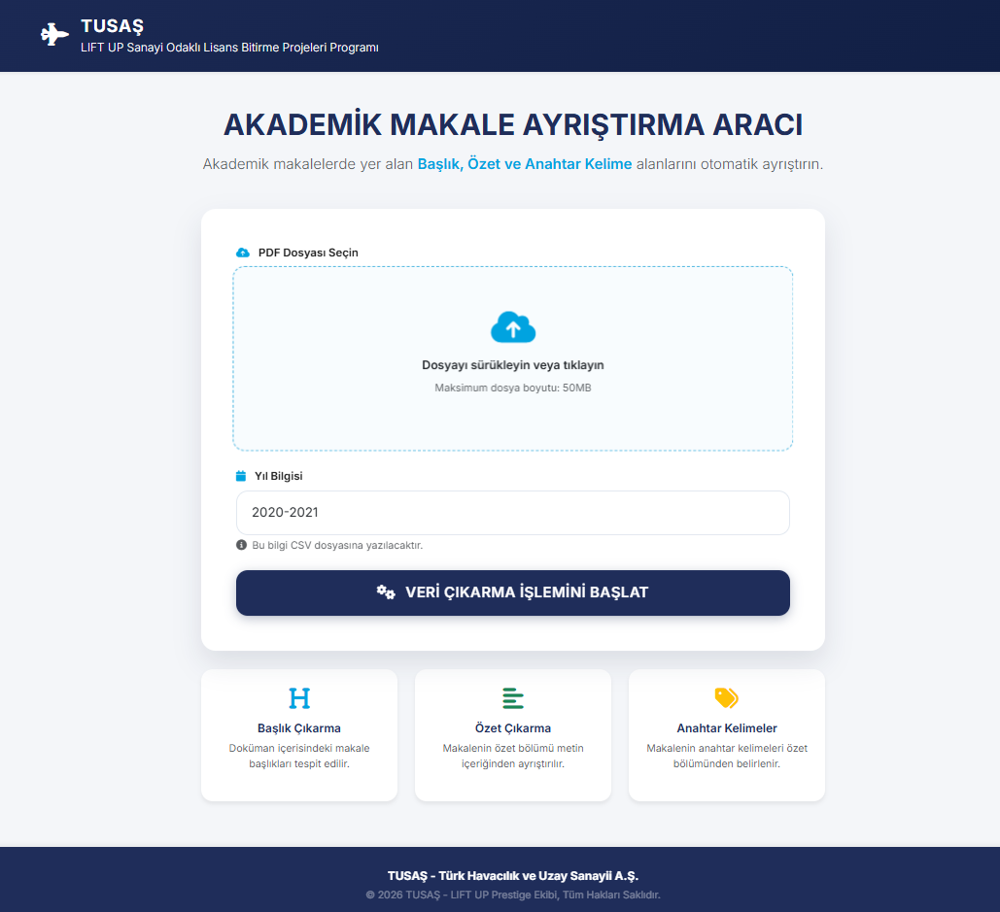
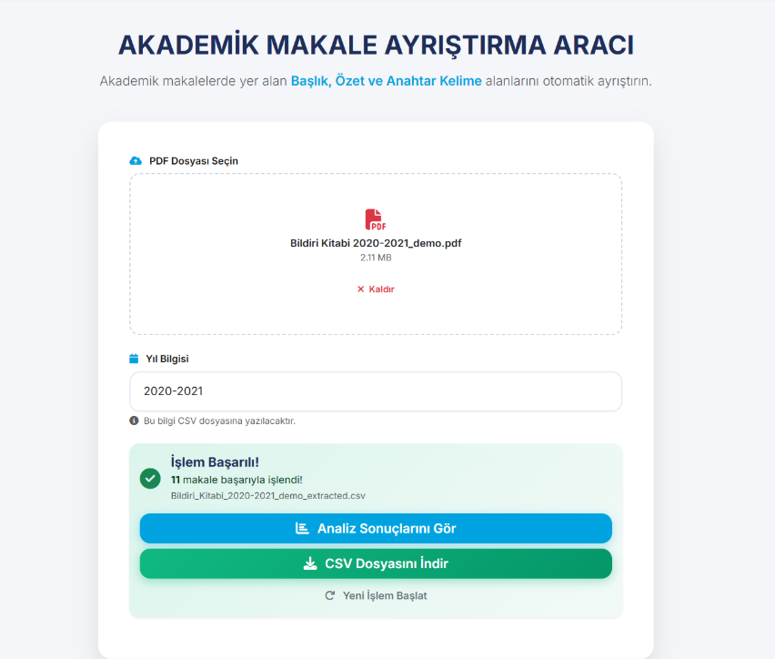
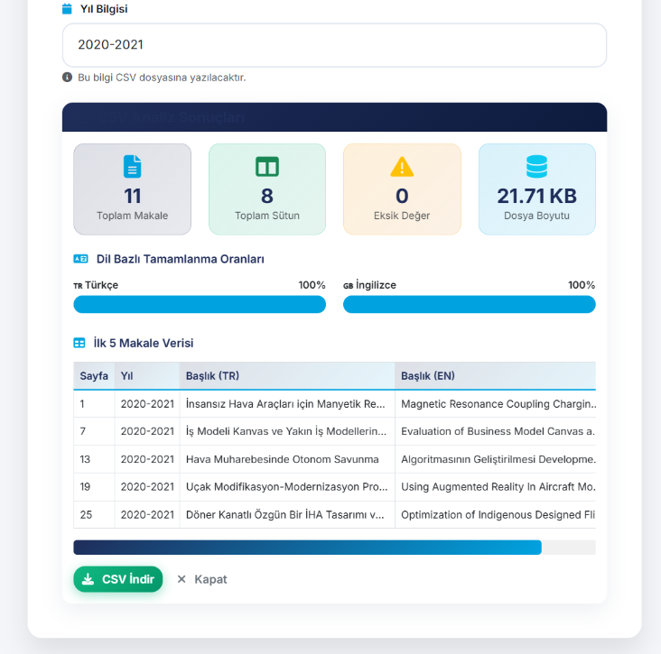

# 🚀 LIFT UP Dataset Extraction Tool

<div align="left">


</div>

<p align="left">
  <strong>TUSAŞ LIFT UP Sanayi Odaklı Lisans Bitirme Projeleri</strong> programı kapsamında yayınlanan bildiri kitapçıklarından (PDF) otomatik veri seti çıkaran otomasyon aracı.
</p>

---

Bu proje, akademik metinleri **Türkçe (TR)** ve **İngilizce (EN)** olarak ayrıştırarak NLP (Doğal Dil İşleme) çalışmaları için yapılandırılmış `.csv` veri setleri oluşturur.

## 📋 Özellikler

| Özellik | Açıklama |
| :--- | :--- |
| **📄 Otomatik PDF Ayrıştırma** | PDF içindeki makalelerin başlıkları, özetleri ve anahtar kelimelerini dil ayrımını koruyarak otomatik tespit eder. |
| **💻 Modern Web Arayüzü** | Veri çekimi ve analiz imkanı sunan kullanıcı dostu arayüz. |
| **📊 Veri Analizi** | Çıkarılan verilerin doluluk oranlarını, dil dağılımını ve eksik verileri anlık analiz eder. |


## 📁 Proje Yapısı

```text
LIFT-UP-Dataset-Preparation/
│
├── data_extract_automation/      # Web Uygulaması
│   ├── static/
│   │   ├── app.js                # Frontend mantığı
│   │   └── style.css             # TUSAŞ temalı tasarım
│   ├── templates/
│   │   └── index.html            # Ana sayfa
│   ├── app.py                    # Flask uygulaması
│   ├── analysis.py               # Analiz modülü
│   └── data_extract.py           # PDF işleme motoru
│
├── notebooks/                   
│   ├── Data_Merging.ipynb        # Veri Birleştirme
│   └── Data_Preprocessing.ipynb  # Veri Ön İşleme
│
├── data_collection.py           # CLI (Komut Satırı)
└── README.md
```
## 🚀 Kurulum
Projeyi yerel ortamınızda çalıştırmak için aşağıdaki adımları sırasıyla uygulayın.

1. Repoyu Klonlayın
```text
git clone https://github.com/ensarakbas77/LIFT-UP-Dataset-Preparation.git
cd LIFT-UP-Dataset-Preparation
```
2. Sanal Ortam Oluşturun
```text
python -m venv .venv

## Windows için:
.venv\Scripts\activate

## Mac/Linux için:
source .venv/bin/activate
```
3. Gerekli Kütüphaneleri Yükleyin
```text
requirements.txt
```

## 💻 Kullanım
Projeyi iki farklı şekilde kullanabilirsiniz: Web Arayüzü veya Komut Satırı (CLI).

### 🌐 Yöntem 1: Web Arayüzü (Önerilen)
Kullanıcı dostu arayüz üzerinden PDF yükleyip analiz sonuçlarını görebilirsiniz.

Uygulamayı başlatın:
```text
python data_extract_automation/app.py
```
Tarayıcınızda şu adrese gidin: 
```text
http://localhost:5000
```
1. PDF dosyasını sürükleyip bırakın  
2. **“Veri Çıkarma İşlemini Başlat”** butonuna tıklayın  
3. İşlem tamamlandığında:
   - CSV indirilebilir.
   - Analiz ekranı görüntülenebilir.


### 🖥️ Yöntem 2: Komut Satırı (CLI)
data_collection.py dosyasını açarak PDF_PATH değişkenini düzenleyin.

Scripti çalıştırın:
```text
python data_collection.py
```

## 🔧 Nasıl Çalışır? 
Bu araç, PDF madenciliği yaparken aşağıdaki stratejileri izler:

### 🧩 Makale Tespiti
- Sayfa içerisinde **“Özetçe”** ve **“Abstract”** kelimeleri aranır.  
- Bu kelimeler yeni makale başlangıcı olarak kabul edilir.

### 🏷️ Başlık Ayrıştırma
- Sayfadaki **en büyük font boyutu** tespit edilir.  
- Türkçe / İngilizce ayrımı için:
  - Satır boşluğu
  - İngilizce kelime ipuçları
  - Türkçe karakter varlığı

## 📊 Çıktı Formatı (CSV)

| Sütun | Açıklama |
|------|---------|
| PageNumber | Makalenin başladığı sayfa |
| Year | Bildiri yılı |
| Title_TR | Türkçe başlık |
| Title_EN | İngilizce başlık |
| Abstract_TR | Türkçe özet |
| Abstract_EN | İngilizce özet |
| Keywords_TR | Türkçe anahtar kelimeler |
| Keywords_EN | İngilizce anahtar kelimeler |


## 🎨 Arayüz & Tasarım

Uygulama, **TUSAŞ kurumsal renk paleti** kullanılarak modern ve sade bir tasarım anlayışıyla geliştirilmiştir.

### ✨ Yükleme Ekranı
<p align="center">
  
</p>

- Sürükle bırak PDF yükleme alanı  
- Dosya adı ve boyutunun gösterimi  
- Kullanıcıya yönlendirici geri bildirimler  

---

### ⚙️ PDF İşleme & Sonuç Ekranı
<p align="center">
  
</p>

- Yüklenen PDF’in işlenme durumu  
- Başarılı işlem bildirimi  
- CSV indirme ve analiz ekranına geçiş aksiyonları  

---

### 📈 Analiz Ekranı
<p align="center">
  
</p>

- Türkçe / İngilizce alanlar için veri doluluk oranları  
- Eksik alanların görselleştirilmesi  
- Çıkarılan verilerin tablo önizlemesi  


## 🎓 Proje Bağlamı

Bu çalışma, **TUSAŞ LIFT UP – Sanayi Odaklı Lisans Bitirme Projeleri** kapsamında geliştirilmiştir.  
Amaç, akademik bildirilerden **tekrar kullanılabilir, temiz ve analiz edilebilir** veri setleri üretmektir.
